# mySQL-amazon

## mySQL Homework

This assignment was completed for Rutgers Coding Bootcamp. 
The assignment required us to create an Amazon-like storefront that will take in customer orders, update and track the store's inventory, and add new items to sell. 

## Getting Started
  * Clone repository
  * Run 'npm install' in Terminal or GitBash
  * Run 'node bamazonCustomer.js'or 'bamazonManager.js'
 
## Bamazon Customer Actions
### Buying an Item
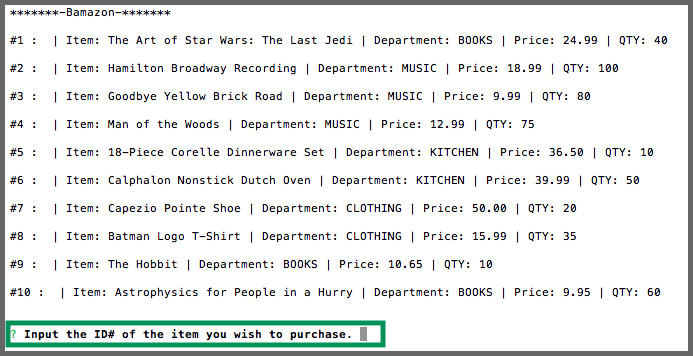
**- A list of products that can be purchased appears**
**- The user is then prompted to type the ID# of the item they would like to purchase**
     

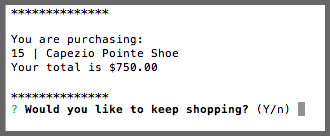

### If an item is out of stock
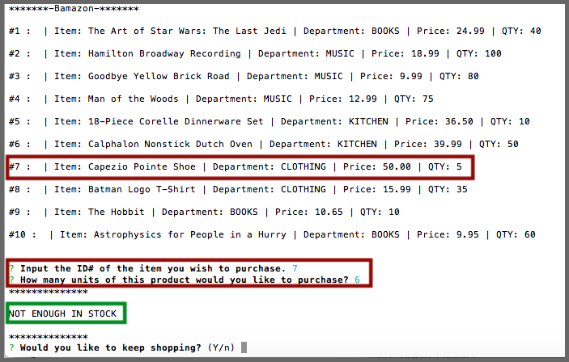

## Bamazon Manager Actions
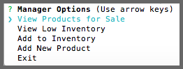
### View Products for Sale

### View Low Inventory
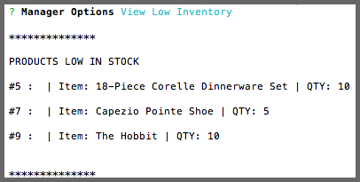
### Add to Inventory
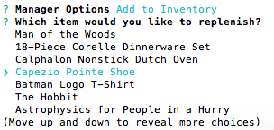
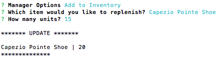
### Add New Product
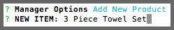
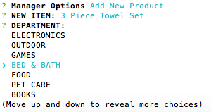
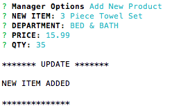
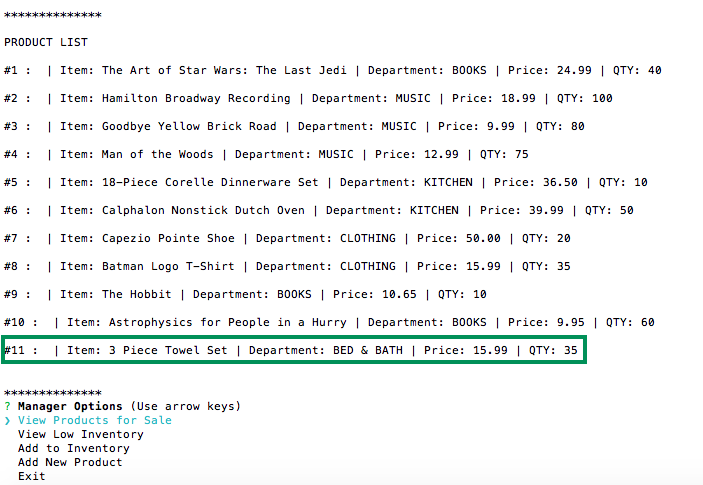

## Programs Used
- Node.js
- Inquirer Package https://www.npmjs.com/package/inquirer
- mySQL Package https://www.npmjs.com/package/mysql

## Built With
- Sublime Text - Text Editor
- MySQL Work Bench

## Authors
- Sarika Matthew

## Instructors
- John Dougherty
- Tom Keel - TA
- Evan Arbeitman - TA
