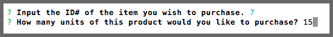
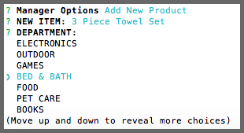
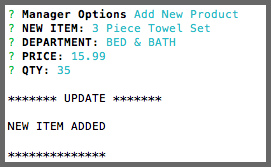
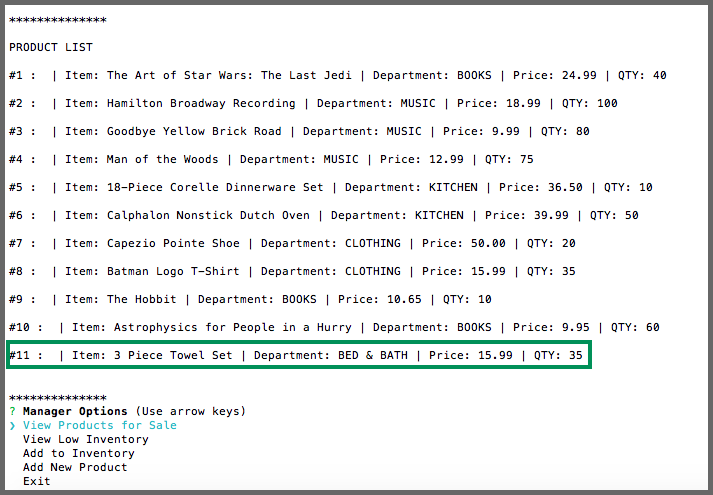

# mySQL-amazon

## mySQL Homework

This assignment was completed for Rutgers Coding Bootcamp. 
The assignment required us to create an Amazon-like storefront that will take in customer orders, update and track the store's inventory, and add new items to sell. 

## Getting Started
  * Clone repository
  * Run 'npm install' in Terminal or GitBash
  * Run 'node bamazonCustomer.js'or 'bamazonManager.js'
 
## Bamazon Customer Actions
### Buying an Item

 * A list of products that can be purchased appears.
 * Input the ID# of the item to be purchased.
---
  
  

 * Input how many units of the selected product is going to be purchased.
---
  
  

 * A reciept is shown .
 * The customer is asked if they would like to keep shopping. If the answer is yes, the product list appears again. If the answer is no, the session ends.
---
  
  
### If an item is out of stock

 * If there is not enough of an item to complete the customer's request, they will recieve a notice and the purchase will not be made.
---
  
  
  
## Bamazon Manager Actions

 * The mananager is given a menu of tasks they can run.
 * Each task is described below.
---
  
  
### View Products for Sale
 * This shows the same list that the customer sees.
   
   
### View Low Inventory

 * If an item has less than 15 units in stock, it will appear on this list.
---
  
  
### Add to Inventory

 * Pick which item to add units to.
---
  
  

 * Indicate how many units should be added and then the product is updated.
---
  
  
### Add New Product

 * Input the name of a new product.
---
  
  

 * Select the appropriate department for the new product.
---
  
  

 * Input the price and quantity for the item.
 * The manager will recieve a notification that the item has been added to the product list.
---
  
  

 * The manager can now see the item when the product list is requested
 * Select 'EXIT' to end the manager session.
---

## Programs Used
- Node.js
- Inquirer Package https://www.npmjs.com/package/inquirer
- mySQL Package https://www.npmjs.com/package/mysql

## Built With
- Sublime Text - Text Editor
- MySQL Work Bench

## Authors
- Sarika Matthew

## Instructors
- John Dougherty
- Tom Keel - TA
- Evan Arbeitman - TA
